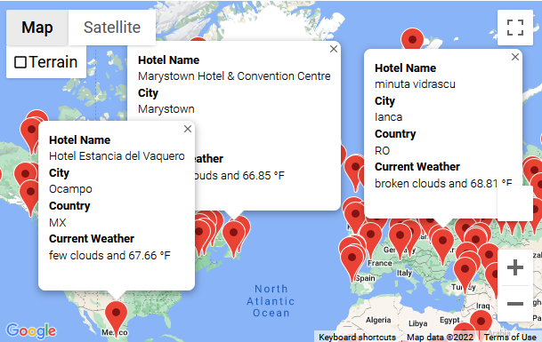
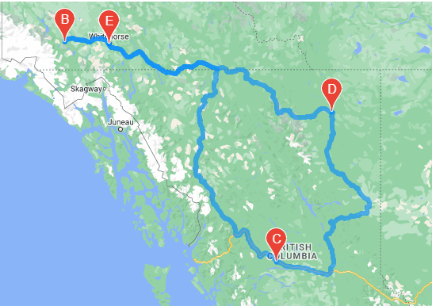

# World Weather Analysis
### Use of API to call weather and google map data to code that we have created

## Weather Database
The program for this module creates random coordinate pairs that are then used to search for the nearest city for each coordinate pair which is added to a database. The weather api is used to get general weather info for each city which then exported into a csv file.

## Vacation Search
The csv file is imported into a new database then used to find cities that fit a temperature range that is prompted by the user. Hotels that are close to the cities that fit the criteria will be added to a new database using the google maps api. A map is then created with hotels from the database.

## Vacation Itinerary
An example of 4 chosen locations for a vacation. Google maps api is then used to plot a route between them.

